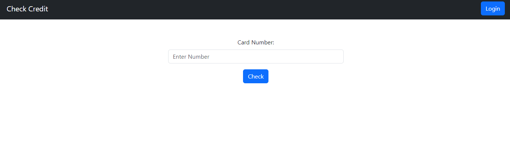
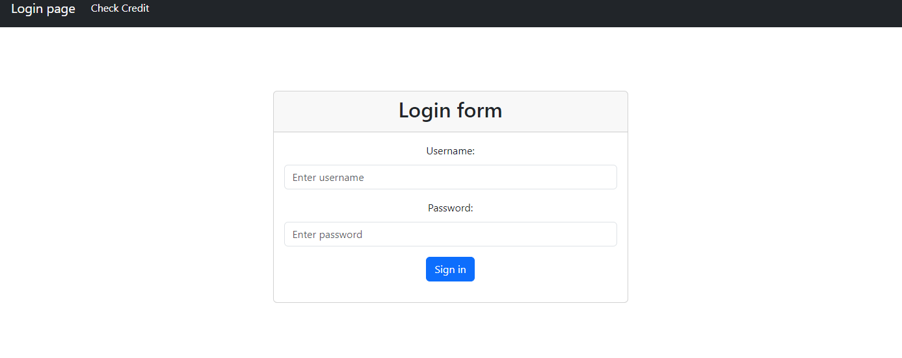
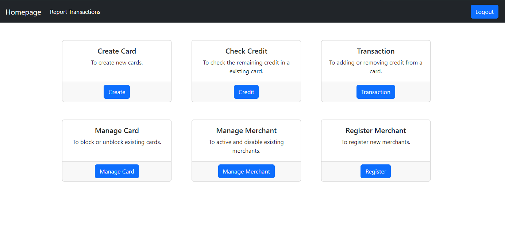
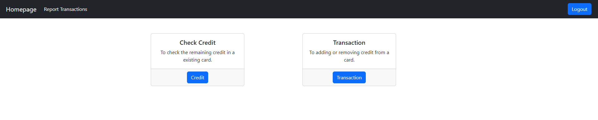

# Simple Card Manager
## Overview
A Simple Card Manager using Spring Boot for Web Application 1 course at Università degli studi di Palermo.
The project consists of three roles: Admin, Merchant and User who can control their credit on the card without login.

## Main window
### Credit screen without a Login:


### The Login screen:


### The Admin Hompage:


## The Merchant Hompage:


## Functionality
### Admin
- __Create Card__: To create new cards

- __Check Credit__: To check the remaining credit in a existing card.

- __Transaction__: To add or remove funds from a card.

- __Manage Card__: To block or unblock existing cards.

- __Manage Merchant__: To active and disable existing merchants.

- __Register Merchant__: To register new merchants.

### Merchant
- __Check Credit__: To check the remaining credit in a existing card.

- __Transaction__: To add or remove funds from a card. 

## Initialization

The project has a ```db.sql```file in ```src/main/resources``` to create the initialized database with some users, cards and transactions.

Then you need to modify the **'application.propertis'** file in **'src/main/resources'** with your db information.

## Default config in ```db.sql```

These are the access credentials:

### Ruolo admin:

Username: ```admin```

Password: ```admin```


### Role Merchant:

Username: ```merchant```

Password: ```merchant```


Username: ```merchant2```

Password: ```merchant2``` 

(This last user is disabled)


### Card information:

The existing card numbers has id numbers: ```100```,  ```101```, ```102```. The last one is locked. 
